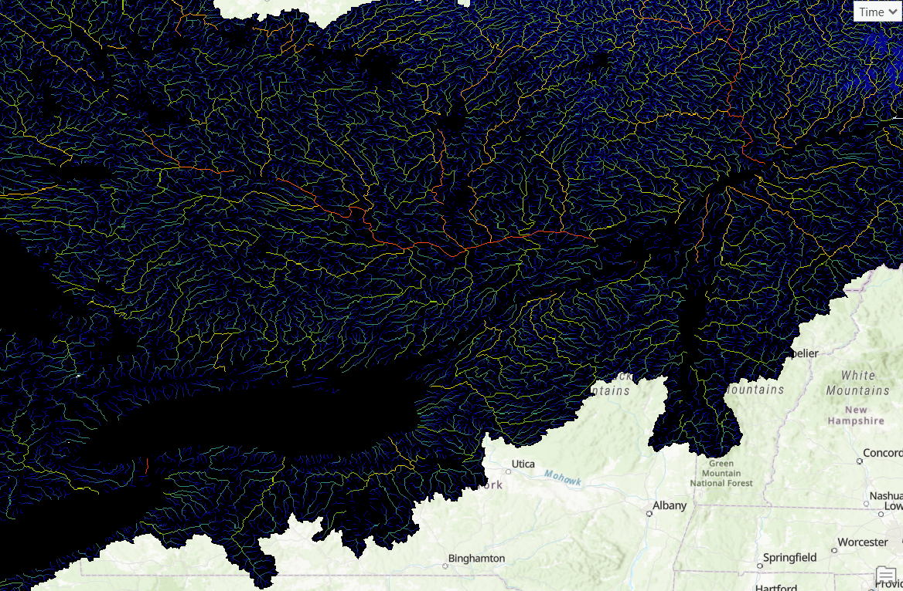
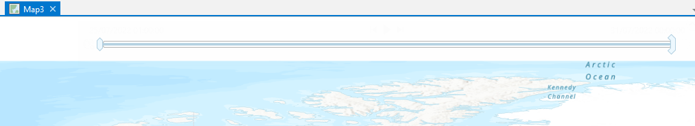
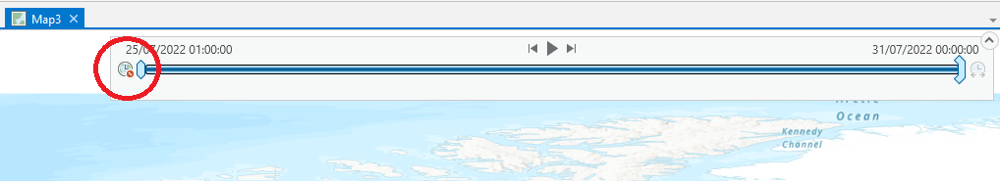
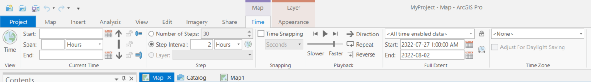

# MSC Geomet Example - Connecting to Authenticated WMS with ArcGIS Pro

This example shows how to connect ArcGIS Pro to the username/password authenticated Web Map Service (WMS) layers on the Meteorological Service of Canada (MSC) GeoMet platform.

## Connect to WMS
First, in a new (or existing) map, connect to the Geomet data source by selecting 'New WMS Server' from the 'Connections' drop-down from the Insert tab.

Unlike the non-authenticated GeoMet layers, all authenticated layers are hidden such that they can't be discovered from the tree available through a connection to the top level of GeoMet. Rather, each layer needs to be added individually as a separate WMS connection. We then need to supply a geomet path complete with hidden layer name.

To view, for example, the 1km river discharge output from the Deterministic Hydrologic Prediction System (DHPS), enter the URL to the WMS layer, complete with the "LAYERS" parameter and name of layer you wish to connect to: https://geo.weather.gc.ca/geomet?LAYERS=DHPS_1km_RiverDischarge. Add User and Password credentials at the bottom. Click OK.

## Add Layer to Map
At a glance, this doesn't appear to do much as it has only opened the connection. The easiest way to add the layer is from the Catalog Pane. Although open by default, if not this can be added from the View tab:

On the Catalog pane, expand 'Folders', the current project, then fully expand the new 'MSC GeoMet...' entry to the layer name ("DHPS - Streamflow discharge [m^3/s]" for this example). Drag the layer to the map, or right-click and Add to Current map, or to a new map/scene.

This shows the extent of the layer, but it's all dark and there's not much to see, even if we zoom to a smaller area:

The reason is that the DHPS river discharge WMS layer includes multiple styles to address wide variations in flow magnitude across Canada. The previous steps should have loaded the default style, but they did not - this is something that needs to be addressed in a later version. 

We need to apply a better style but fortunately there is one ready to use. Expand the MSC GeoMet entry in the Contents pane and select DHPS - Streamflow discharge [m^3/s]. There should now be a highlighted 'Appearance' tab on the toolbar. Select this tab, then the Symbology button to open the Symbology pane. In the Symbology drop-down box, it shows that the layer is already using the RiverDischarge symbology (designed for a large range of flows), however this is not working properly. To apply the RiverDischarge symbology, select any of the other options then re-select RiverDischarge. The colour style should update live (maybe after a few seconds depending on processing capacity).

Now we have a much more useful range of colours.

## View Data

Finally, while the WMS is suited more for raster imagery, you can also view the underlying values by selecting a grid cell using 'Explore'. for this to work in ArcGIS Pro, it is necessary to zoom (very) close to the feature(s) of interest, and select 'Explore' from the 'Map' tab on the toolbar.

Click on the point of interest and the result will appear in the Identify tool's pop-up box. For example, for the DHPS 1km River Discharge in the Ottawa River near Britannia Beach at the time of writing:

If the Explore tool returns multiple results, the tool is including results from surrounding pixels; zooming closer will improve the function.

## View 'Time-enabled' Data

Many datasets available on the GeoMet platform include data for a range of times. In the case of DHPS, a 12-hour assimilation cycle is followed by a 6-day forecast. When DHPS is loaded into a GIS package, it is possible to step or animate through the forecast period. In ArcGIS Pro, when a 'time-enabled' WMS layer is added to a map, a time slider bar will appear as a kind of ghost image along the top of the view.

**An important note regarding viewing time-enabled WMS layers in ArcGIS Pro: ESRI is/was aware of an issue with certain versions of ArcGIS Pro where loading the timed layer(s) appears to work, but actually viewing different time steps does not work. Thes appears to be fixed in recent versions. In testing to prepare this tutorial, the author was unable to animate or select alternate time steps in version 2.6.0, but version 2.9.3 appeared to function as expected.**

To activate the time slider, click the clock button at the left end of the slider to enable the time functions.

In addition to displaying the time slider, when a time-enabled layer is loaded into the map, the Time tab is added to the tool bar.

On the Time tab you'll find most if not all the settings related to controlling the viewing and animating of the time-enabled layer(s). For DHPS, it appears to work well to set the Span (at left) to zero, set the time interval to 1 or 2 hours, and reduce the Playback speed by 20-30%. Note also that when the layer is loaded, the full time extent of the slider should be appropriate, but does not appear to update if, say, the user returns to the same map a day later when a new forecast range is available.

