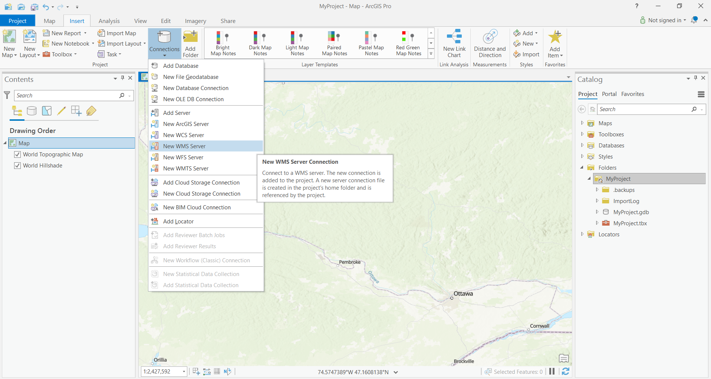
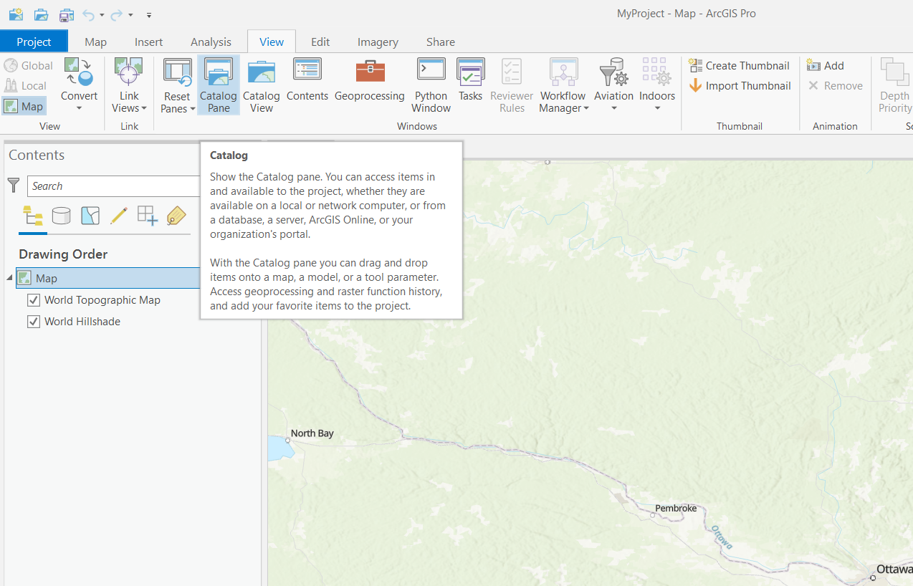
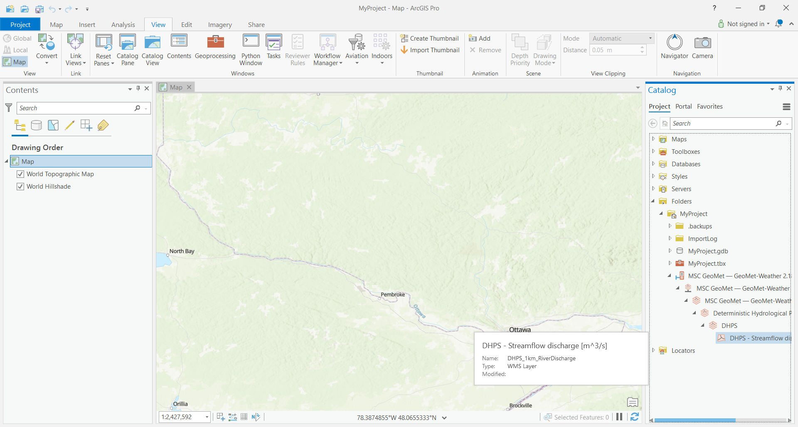
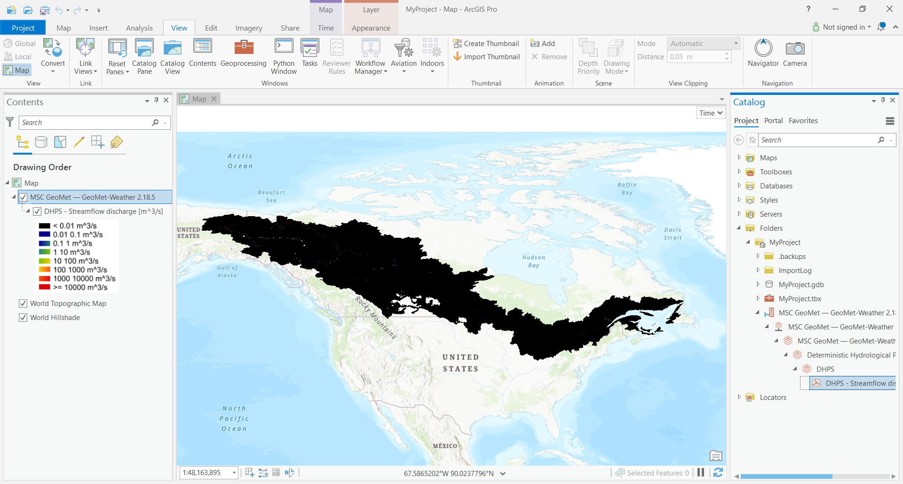
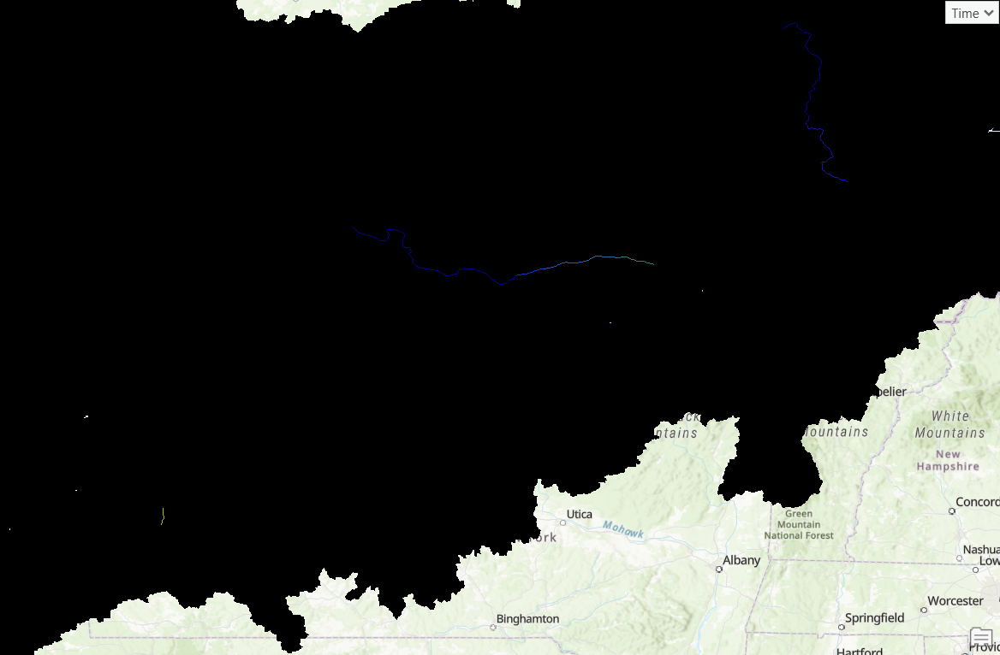
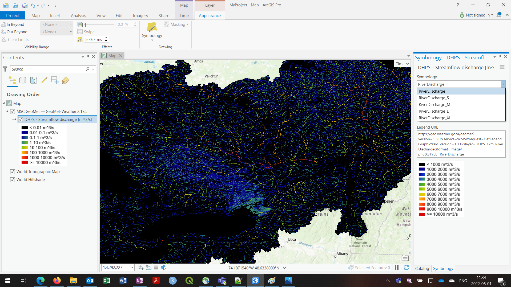

# MSC Geomet Example - Connecting to Authenticated Layers with ArcGIS Pro

This example shows how to connect ArcGIS Pro to the username/password authenticated Web Map Service (WMS) layers on the Meteorological Service of Canada (MSC) GeoMet platform.

## Connect to WMS
First, in a new (or existing) map, connect to the Geomet data source by selecting 'New WMS Server' from the 'Connections' drop-down from the Insert tab.

Unlike the non-authenticated GeoMet layers, all authenticated layers are hidden such that they can't be discovered from the tree available through a connection to the top level of GeoMet. Rather, each layer needs to be added individually as a separate WMS connection. We then need to supply a geomet path complete with hidden layer name.

To view, for example, the 1km river discharge output from the Deterministic Hydrologic Prediction System (DHPS), enter the URL to the WMS layer, complete with the "LAYERS" parameter and name of layer you wish to connect to: https://geo.weather.gc.ca/geomet?LAYERS=DHPS_1km_RiverDischarge. Add User and Password credentials at the bottom. Click OK.

## Add Layer to Map
At a glance, this doesn't appear to do much as it has only opened the connection. The easiest way to add the layer is from the Catalog Pane. Although open by default, if not this can be added from the View tab:

On the Catalog pane, expand 'Folders', the current project, then fully expand the new 'MSC GeoMet...' entry to the layer name ("DHPS - Streamflow discharge [m^3/s]" for this example). Drag the layer to the map, or right-click and Add to Current map, or to a new map/scene.

This shows the extent of the layer, but it's all dark and there's not much to see, even if we zoom to a smaller area:

The reason is that the DHPS river discharge WMS layer includes multiple styles to address wide variations in flow magnitude across Canada. The previous steps should have loaded the default style, but they did not - this is something that needs to be addressed in a later version. 

We need to apply a better style but fortunately there is one ready to use. Expand the MSC GeoMet entry in the Contents pane and select DHPS - Streamflow discharge [m^3/s]. There should now be a highlighted 'Appearance' tab on the toolbar. Select this tab, then the Symbology button to open the Symbology pane. In the Symbology drop-down box, it shows that the layer is already using the RiverDischarge symbology (designed for a large range of flows), however this is not working properly. To apply the RiverDischarge symbology, select any of the other options then re-select RiverDischarge. The colour style should update live (maybe after a few seconds depending on processing capacity). Now we have a much more useful range of colours.

## Updated to here!

## View Data

Finally, while the WMS is suited more for raster imagery, you can also view the underlying values by selecting a grid cell using 'Identify'. for this to work in ArcMap, it is necessary to zoom (very) close to the feature(s) of interest, and select 'Identify' from the toolbar.

Click on the point of interest and the result will appear in the Identify tool's pop-up box. For example, for the DHPS 1km River Discharge in the Ottawa River near Britannia Beach at the time of writing:

If the Identify tool returns multiple results, the tool is including results from surrounding pixels; zooming closer will improve the function.

