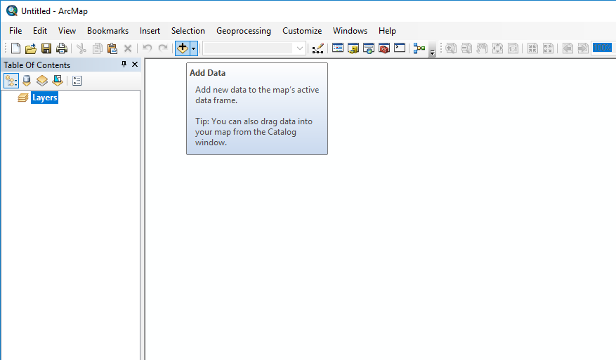
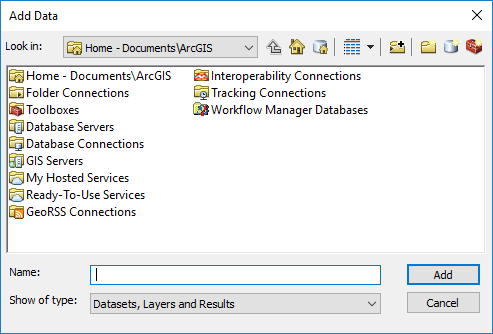
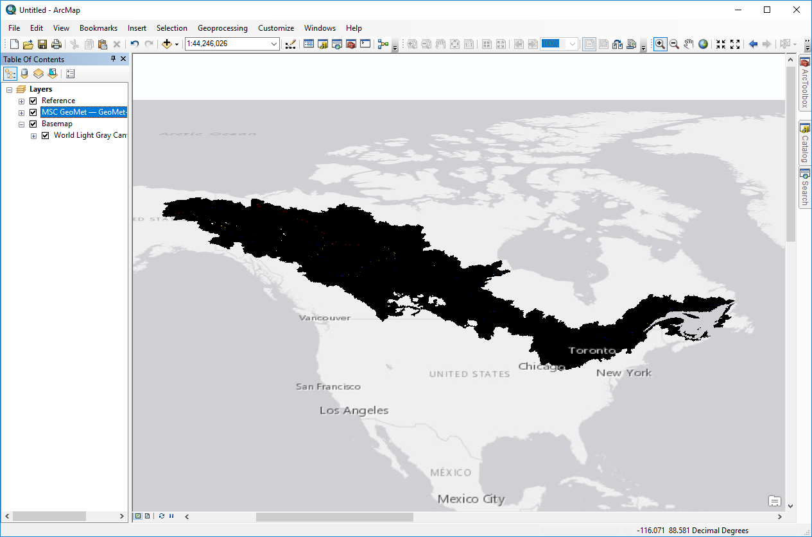
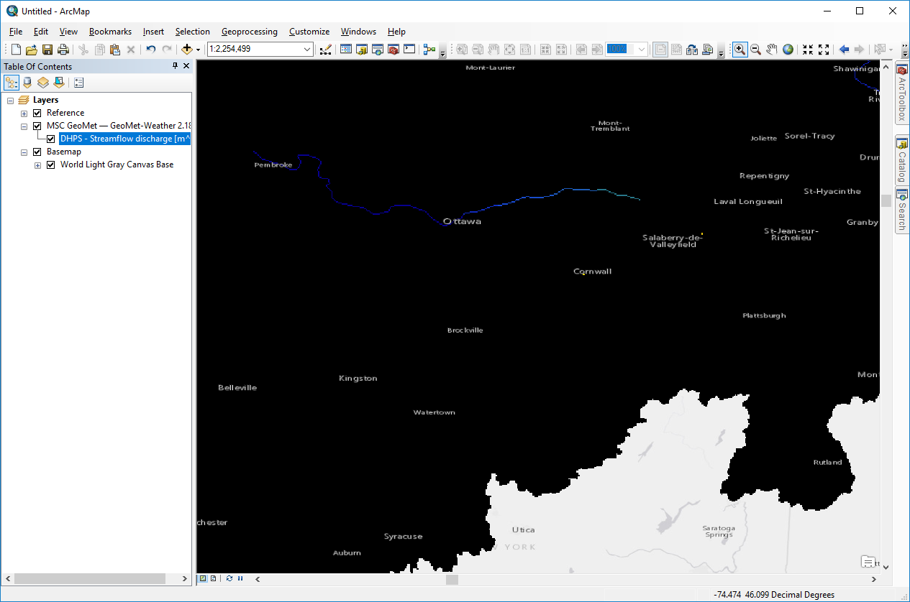
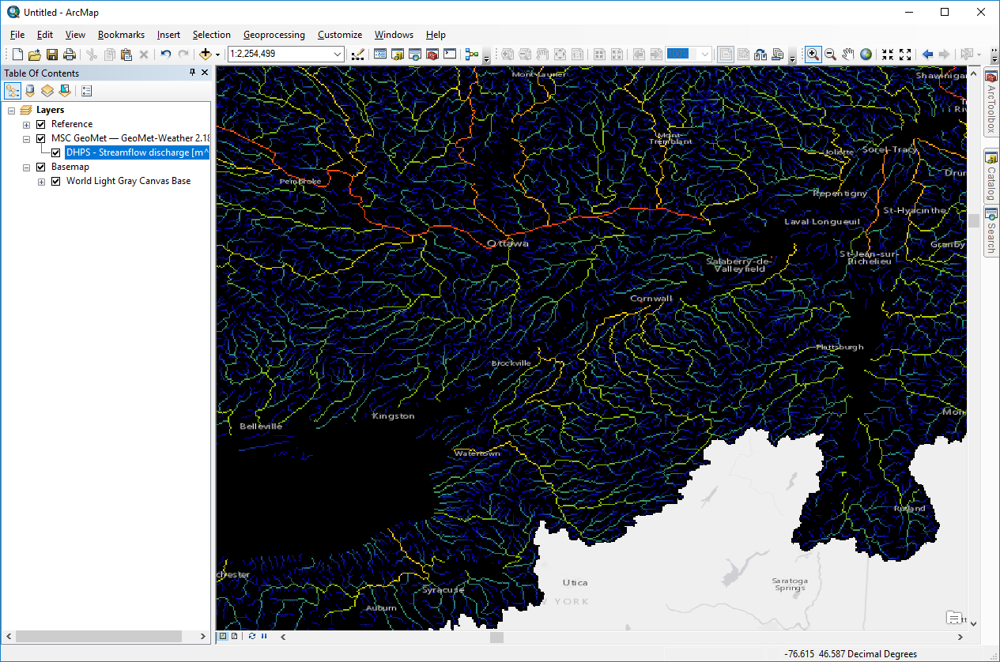
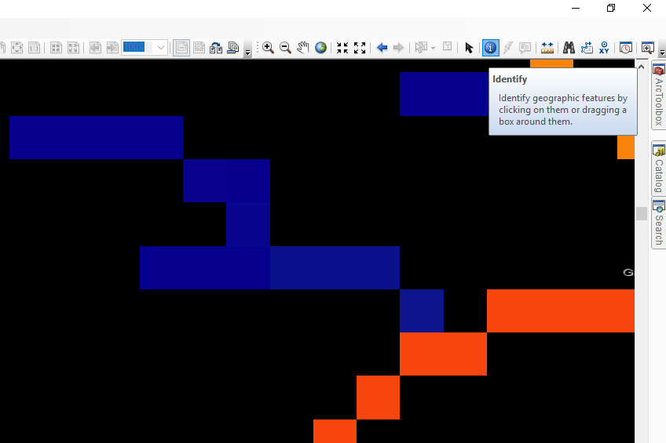
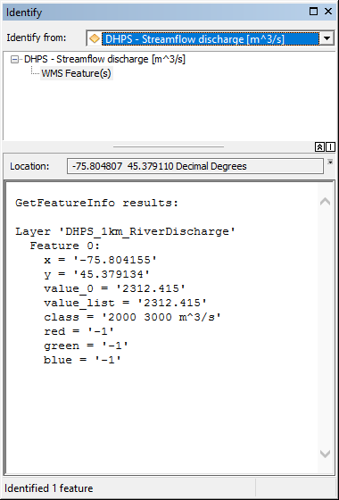

# MSC Geomet Example - Connecting to Authenticated WMS with ArcMap

This example shows how to connect ArcMap to the username/password authenticated Web Map Service (WMS) layers on the Meteorological Service of Canada (MSC) GeoMet platform.

## Connect to WMS
First, connect to the Geomet data source by selecting 'Add Data'.

If necessary click 'Up One Level' until this level is shown. 

Unlike the non-authenticated GeoMet layers, all authenticated layers are hidden such that they can't be discovered from the tree available through a connection to the top level of GeoMet. Rather, each layer needs to be added individually as a separate WMS connection.

Double-click 'GIS Servers', then 'Add WMS Server'. We then need to supply a geomet path complete with hidden layer name. To view, for example, the 1km river discharge output from the Deterministic Hydrologic Prediction System (DHPS), enter the URL to the WMS layer, complete with the "LAYERS" parameter and name of layer you wish to connect to: https://geo.weather.gc.ca/geomet?LAYERS=DHPS_1km_RiverDischarge. Add User and Password credentials at the bottom. Click OK.

## Add Layer to Map
This will take you back to the file/folder dialog. Select the newly added 'MSC GeoMet' entry and drill down to the layer name ("DHPS - Streamflow discharge [m^3/s]" for this example) and click 'Add'.

This shows the extent of the layer, but it's all dark and there's not much to see, even if we zoom to a smaller area:

The reason is that the DHPS river discharge WMS layer includes multiple styles to address wide variations in flow magnitude across Canada. The previous steps should have loaded the default style, but they did not - this is something that needs to be addressed in a later version. 

We need to apply a better style but fortunately there is one ready to use. Expand the MSC GeoMet entry in the 'Table of Contents', right-click on DHPS - Streamflow discharge [m^3/s] and open the layer properties. On the Styles tab, under 'Select layer style', there is a drop down list of available styles. These have different legends to display different flow magnitudes more effectively, ranging (for the DHPS discharge example) from smaller rivers "RiverDischarge_S" to very large rivers "RiverDischarge_XL". Select 'RiverDischarge' and ok. Now we have a much more useful range of colours.

## View Data

Finally, while the WMS is suited more for raster imagery, you can also view the underlying values by selecting a grid cell using 'Identify'. for this to work in ArcMap, it is necessary to zoom (very) close to the feature(s) of interest, and select 'Identify' from the toolbar.

Click on the point of interest and the result will appear in the Identify tool's pop-up box. For example, for the DHPS 1km River Discharge in the Ottawa River near Britannia Beach at the time of writing:

If the Identify tool returns multiple results, the tool is including results from surrounding pixels; zooming closer will improve the function.

