# MSC Geomet Example - Connecting to Authenticated WMS with QGIS (tested on V3.16.7)

This example shows how to connect QGIS to the username/password authenticated Web Map Service (WMS) layers on the Meteorological Service of Canada (MSC) GeoMet platform.

## Connect to WMS
First, connect to the Geomet data source by selecting "Layer -> Data Source Manager" and select WMS/WMTS from the sidebar.

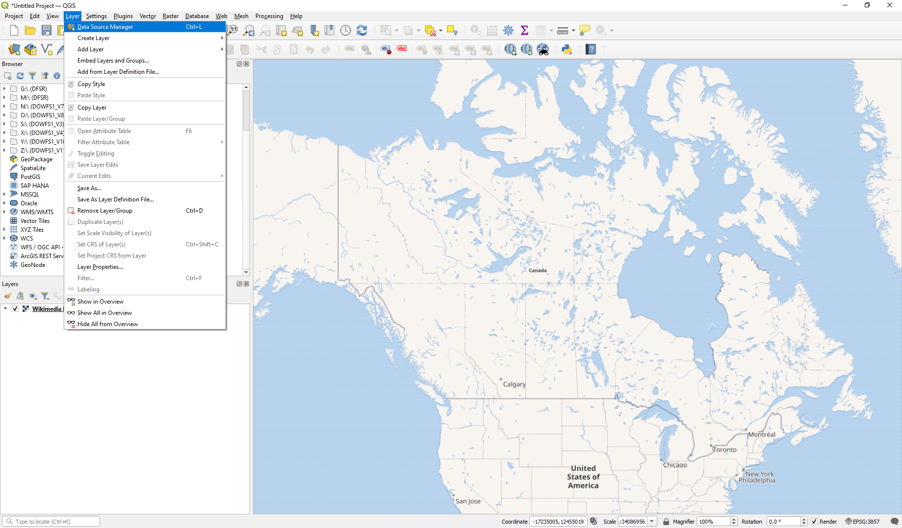

Unlike the non-authenticated Geomet layers, all authenticated layers are hidden such that they can't be discovered from the tree available through a connection to the top level of GeoMet. Rather, each layer needs to be added individually as a separate WMS connection. To do this, under "Layers" select "New".

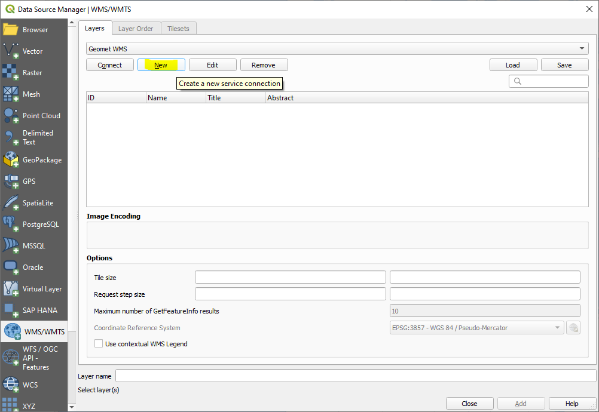

Then, to view, for example, the 1km river discharge output from the Deterministic Hydrologic Prediction System (DHPS), enter a name of your choosing for the connection (e.g., "DHPS_1km_RiverDischarge") then enter the URL to the WMS layer, complete with the "LAYERS" parameter and name of layer you wish to connect to. For the DHPS River Discharge example:

https://geo.weather.gc.ca/geomet?LAYERS=DHPS_1km_RiverDischarge

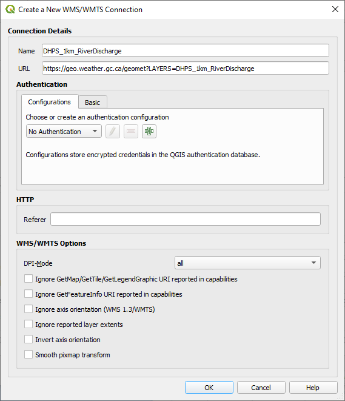

Then under "Authentication", choose the "Basic" tab and add your username and password to authenticate. If you wish, click "Convert to configuration" to save these credentials to a re-usable authentication configuration that is stored in an encrypted database, and can be selected from the Configurations tab for future connections. QGIS may request a new or existing password for the authentication database at this point. You also probably want to rename the converted configuration by selection from the drop-down and clicking the pencil button.

Select "OK" and then in Data Source Manager ensure the new layer is selected and hit "Connect".

## Add Layers to Map

You can now use the browser window to drill down in the newly added data source and add the individual layer to the project.

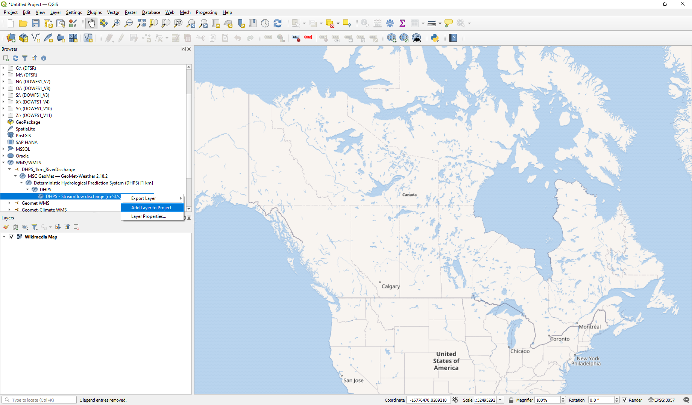

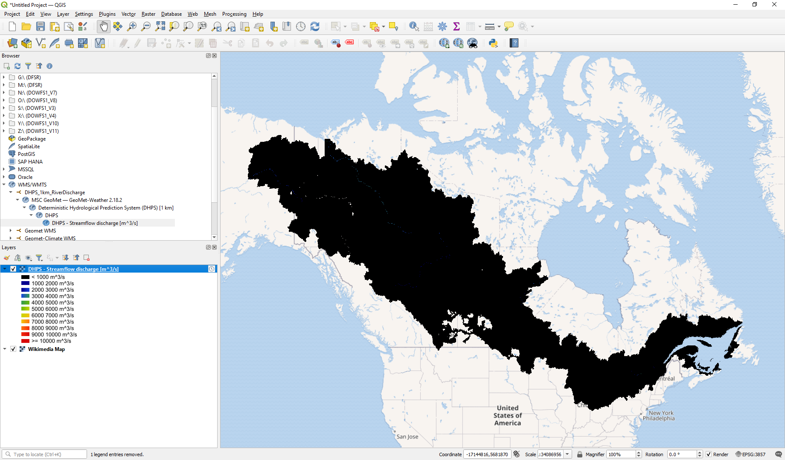

This shows the extent of the layer, but it's all dark and there's not much to see. 

The reason is that the DHPS river discharge WMS layer includes multiple styles to address wide variations in flow magnitude across Canada. The previous steps should have loaded the default style, but they did not - this is something that needs to be addressed in a later version.

To view additional styles, you can add each style as a separate layer. Select "Layer -> Add Layer -> Add WMS/WMTS Layer...".

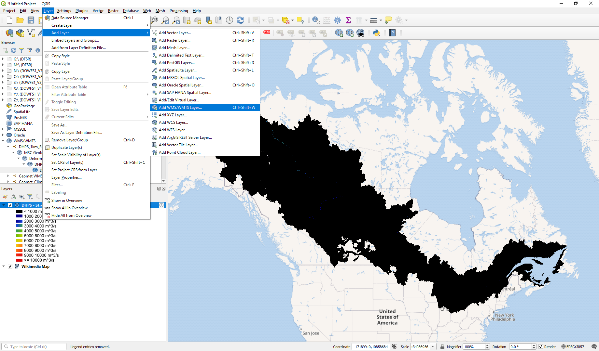

In the Data Source Manager dialog box, select the data source of interest from the drop down list at the top and click "Connect". Drill down in the data source you added previously until you see several style options. These have different legends to display different flow magnitudes more effectively, ranging (for the DHPS discharge example) from smaller rivers "RiverDischarge_S" to very large rivers "RiverDischarge_XL".

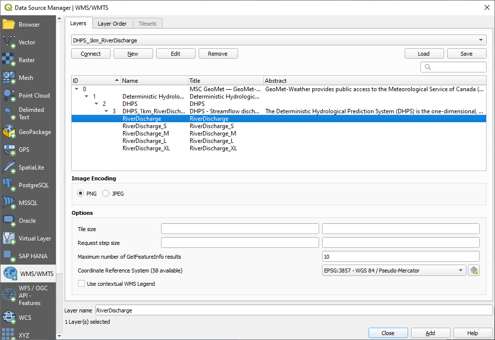

Choose "RiverDischarge", which is the true default style. To support the "Identify Features" function in the last step of this tutorial, set "Feature limit for GetFeatureInfo" to 1. Click "Add".

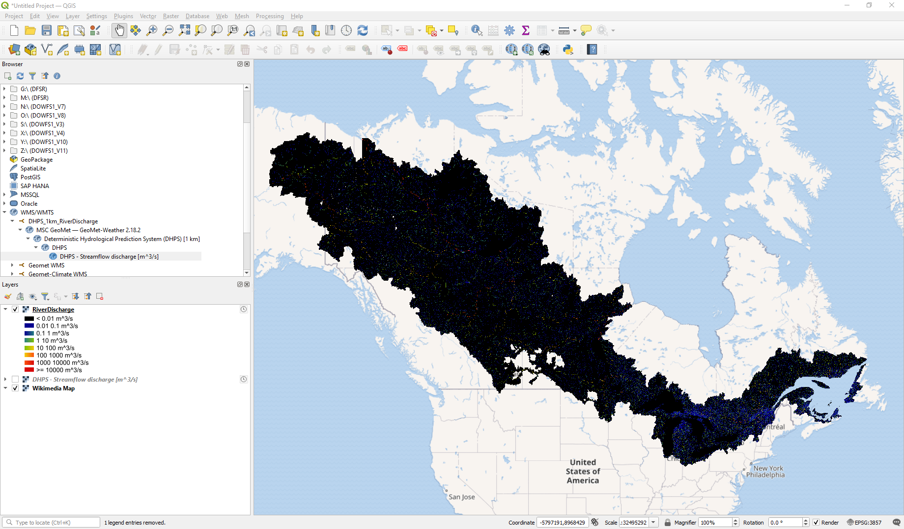

Zoom in to see a better example of the river discharge output from DHPS.

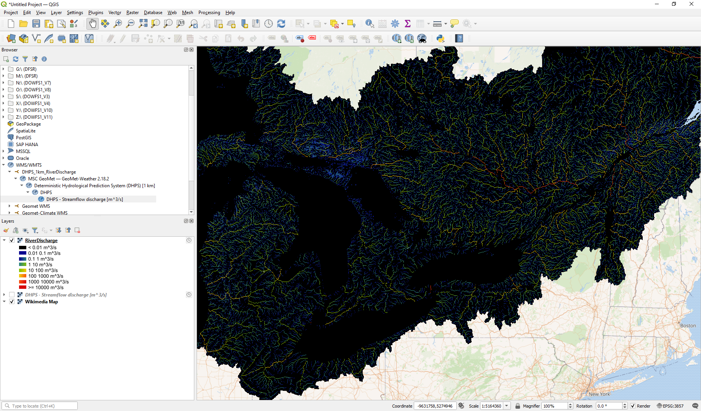

## View Data

Finally, while the WMS is suited more for raster imagery, you can also view the underlying values by selecting a grid cell using "Identify Features". Select it in from the "View" menu, or from the Attributes toolbar, highlighted below.

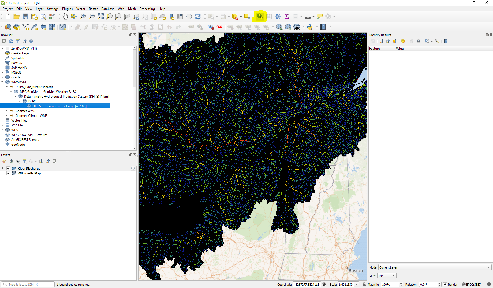

Then zoom in to carefully click on a grid cell. The results will show in the "Idenfify Features" side bar or pop-up box. If the box shows multiple entries, this is due to the "Feature limit for GetFeatureInfo" setting mentioned earlier, but can be worked around by zooming close enough that the user can click near the centre of a cell.

Here's Ottawa River at Brittania, as an example.

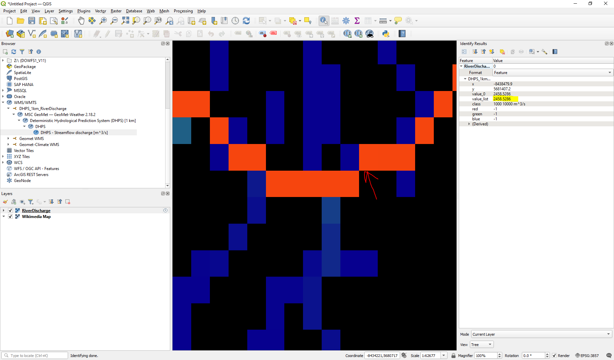

## View 'Time-enabled' Data

Many datasets available on the GeoMet platform include data for a range of times. In the case of DHPS, a 12-hour assimilation cycle is followed by a 6-day forecast. When DHPS is loaded into a GIS package, it is possible to step or animate through the forecast period. To view the time range for DHPS, first activate the Temporal Controller Panel:

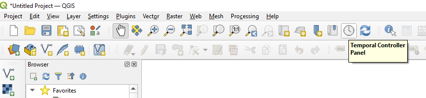

This will open the control panel for time-enabled layers with time navigation disabled. Click the button with a small green 'play' triangle to activate 'Animated temporal navigation' and the settings for the time range and step.

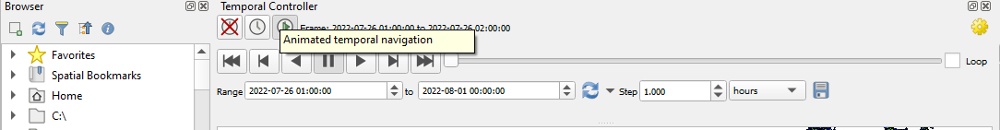

In the control panel, the time/date range should correspond to the range of the forecast, and for DHPS, a time step in hours makes sense. From here, the user can experiment with settings and the play/animate controls. To change the playback speed, click the yellow gear button in the top-right of the panel. One note to add, the author found that the time range for the layer only seems correct at the time of loading and updating the range did not seem to work if, say, the user returns to the project the next day.
